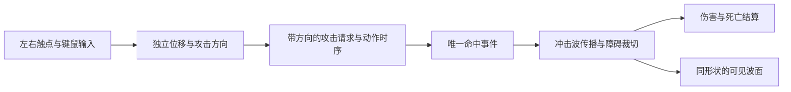

# 《120 秒下班》独立攻击方向与近战冲击波技术设计 v0.1

> 日期：2026-10-02 · 状态：训练场效果已获用户认可，拳击冲击波已接入正式游戏；专用方向步态与踢腿冲击波待实现。
>
> 代码基线：`0497acc`，分支 `polish-character-sprites`。
>
> 本稿记录建议方案；数值均为首轮调试起点，须实玩验收。关联：[产品需求](新增产品需求_拾取补给与战斗动作_2026-09-30.md)、[空手动作交接](主角空手动作_Mixamo选择与交接.md)、[动画调优经验](角色动画调优经验.md)。

> 2026-10-03 更新：用户新增右直拳后，训练场已扩展为刺拳 → 右直拳 → 四连击轮换。下文第 7、8 节保留训练场阶段记录，正式游戏接入见第 9 节。

## 1. 目标与当前差距

让玩家能向后／向左／向右移动，同时向前出拳或踢腿；拳击产生短距离、可命中多个目标的定向冲击波，减轻追怪贴脸攻击的负担。

正式游戏已有拳腿范围判定和移动出拳；独立攻击瞄准、拳击范围预览和传播中的冲击波已从 `combat-preview.html` 接入正式游戏。下表记录设计时的代码基线：

| 当前代码 | 本轮需要改变的行为 |
|---|---|
| `input.ts`：移动每帧覆盖 `lastAim`，鼠标只在停止移动时更新瞄准 | 位移与攻击方向独立保存，鼠标和触屏均可边移动边瞄准 |
| `MeleeRequest` 只有种类和蓄力标记；拳击朝向会随输入变化 | 请求保存方向，动作启动后锁定本次攻击方向 |
| 刺拳范围 74、半角 60°，按目标半径修正后仅命中最近一只 | 在可见波面经过目标时结算范围伤害 |
| 黄色弧线只是短暂装饰，与伤害区域并不一致 | 预览、波面与命中共用形状参数和障碍裁切结果 |

首轮以刺拳打通输入、动画事件、冲击波、命中反馈；后续扩展四连击、勾拳与踢腿。持枪射击操作保持现有规则，本稿不增加刀、投掷物或怪物攻击。

## 2. 操作规则

| 输入 | 建议行为 |
|---|---|
| 左摇杆／WASD | 只决定位移方向与速度，不覆盖已选择的攻击方向 |
| 按住拳／腿按钮并拖动 | 以按下位置为拖动原点，显示方向箭头、范围及蓄力进度 |
| 轻点并松开 | 沿最近一次明确选择的攻击方向攻击；尚未选过方向时沿当前角色朝向 |
| 按住至少 0.65 秒后松开 | 保留勾拳／旋风踢规则；拖动瞄准也计入蓄力时间 |
| 已拖出方向，再拖回中心松开 | 取消本次输入，中心显示取消标识；未拖出过的轻点仍是攻击 |
| `pointercancel`、捕获丢失、失焦、切换装备、游戏结束 | 清除未提交手势和范围预览，不补发攻击 |
| PC 鼠标＋J／K／左键 | 鼠标在移动期间也更新方向，按键松开按相同规则提交；无有效鼠标瞄准时沿用记忆方向 |

- 拖动死区初值 8 CSS px，回中心取消阈值 6 px，旋钮最大偏移 32 px。超出按钮圆圈仍有效，使用 pointer capture；尺寸不随设备像素比变化。
- 屏幕拖动向量通过相机投影转换到地面 XZ 方向：取玩家地面投影点及其加上拖动向量的点，分别射线求地面交点后相减。不能直接把屏幕向上当作世界 `-Z`；横竖屏均要核对箭头与手势方向。
- 每个触点独立保存按下时间、方向和手势状态；摇杆松手不影响攻击手指。多个攻击触点并存时，最近按下的触点显示预览，各自松手提交；同帧请求按时间排序，沿用最多缓存一条下一招的规则。
- 攻击按钮继续使用 Pointer Events；键盘／辅助点击提供无拖动的备用入口，避免合成 click 导致双发，也避免再次出现双指时 click 被拦的问题。

## 3. 方向、动作与移动动画

每次松手提交 `{ kind, charged, aimX, aimZ, requestedAt }`，方向归一化并写入队列。动作开始时生成独立 `attackId`，把该方向复制进 `ActiveMelee`；队列等待、后续移动和另一次瞄准均不能改写它。

- 瞄准和攻击期间，身体面朝攻击方向；普通移动期间身体可回到移动方向，记忆的攻击方向仍保留。活动攻击的身体朝向优先于下一招预览。
- 刺拳、勾拳及四连击整段锁定一次方向，四连击四道波都沿该方向；每道波的起点取实际发出时的玩家地面位置。波发出后起点与方向固定，不跟随人物移动或转向。
- 将世界位移向量转换到身体朝向的局部坐标，选择前进／后退／左右侧移及 Walk／Run；对角方向使用相邻素材混合并保持步伐相位，方向扇区加滞回，避免边界抖动。
- 继续使用 `MeleeBodyFrame` 的骨盆／脊柱坐标转换，核对身体整体姿态和拳头朝向。不能只比较局部骨骼数值，也不能借用 RifleRunShoot 来拼出移动拳击。
- 普通踢腿仍在出腿阶段暂停位移、收势后接回当前移动方向；方向独立不代表支撑脚踢击期间也全速平移。旋风踢暂保留整段播放和整段每目标只伤害一次。

**素材条件：** 现有 Walk／UnarmedRun 只覆盖向前移动。需要用户从 Mixamo 选择空手后退、向左侧移、向右侧移，各含走与跑，共六段；不得用反向播放前进动作或临时手写骨骼动作替代验收。建议文件名为 `ksman_v3_unarmed_{walk|run}_{backward|strafe_left|strafe_right}.fbx`，使用同一人物、In Place（动作支持时）、30 FPS、FBX Binary／Without Skin，兼容性仍按[交接流程](主角空手动作_Mixamo选择与交接.md)检查。素材到位前可以验证方向与伤害逻辑，完整后退／侧移的视觉验收需等对应动作接入。

## 4. 冲击波与伤害

### 首轮刺拳参数

| 参数 | 调试初值及定义 |
|---|---|
| 最远半径 | 112 世界单位，约为原刺拳 74 的 1.5 倍；从发出时玩家地面中心算起，不另加起点偏移 |
| 扇形角度 | 总角度 120°，先保持原有半角 60°，优先验证距离和多目标效果 |
| 传播速度／波面厚度 | 400 单位／秒，厚度 16；前沿从 0 扩展到 112，约 0.28 秒到达边缘 |
| 伤害／发出时机 | 每目标 12；原动作接触点为 17/30 秒。训练场调优后按 2.5 倍播放，同步映射至松手启动后约 0.227 秒发波 |
| 命中次数 | 每道波对同一目标最多一次；可以穿过已命中的敌人继续命中其他敌人 |

波的实体为**向前扩大的扇形环带**。前沿 `r=min(speed×age, range)`，内沿 `max(0,r-thickness)`；前沿到达最大半径后结束伤害，余光最多淡出 0.08 秒。攻击预览表示整道波将经过的区域，不能把整个预览区域当作持续伤害区。

- 与怪物配置的地面碰撞圆相交即可能命中，不能只用怪物中心是否在扇形中判断。调试视图同时显示碰撞圆与波面边缘，便于核对；目标半径属于碰撞体积，不另设隐藏射程加成。
- `WaveInstance` 保存 `waveId / attackId / markerIndex / origin / direction / age / spec / hitTargetIds`。按 `attackId + markerIndex` 保证发波事件唯一，伤害去重使用每道波自己的目标集合。
- 被冲击波命中的拳击目标只通过波结算：替换该招原来的直接扣血，防止近处目标既吃近战伤害又吃波伤害。生成在角色附近的重叠目标也要按波的初始占用区域检查一次。
- 每帧检测波面从旧位置到新位置扫过的区域，并纳入目标前后位置；用按相对位移自适应的子步检查，首轮最大相对步长 4 单位。低帧率不能跳过目标或重复扣血。
- 障碍沿波的传播方向截断，不绕墙、不反弹。复用 `NavigationWorld` 的活动障碍与射线查询，基于扇形边界、均匀采样角、障碍角点及其两侧微小角度构建可见多边形，再与当前环带相交。绘制、预览与碰撞共用该多边形，覆盖薄墙、门框和墙角；障碍状态改变时重算，已经被阻挡消失的波段不能在开门后重新出现。
- 沿用怪物受击闪光、粒子、AI 受击通知、死亡和经验流程；排除出生中及死亡目标，命中去重先登记再派发伤害，避免同帧死亡重复奖励。

四连击在现有四个命中事件分别发波，每道波单独去重，同一目标整段最多吃四次伤害。勾拳保留 24 伤害，范围先沿用普通拳，使用更明显的波面表现；暂不同时扩大射程和伤害。踢腿后续复用方向和范围接口，以较宽弧形扫击为主，数值另行实玩调整。

已发出的波在切换装备后继续完成自身生命周期；切换只取消未发出的命中事件、蓄力和排队攻击。游戏结束／重开时清空所有波、预览和命中集合。

## 5. 代码职责与更新顺序

| 文件／模块 | 计划职责 |
|---|---|
| `input.ts`、`combat-input.ts` | 手势状态、屏幕到地面方向、方向记忆、带方向的请求；保留多触点隔离 |
| `melee.ts` | 招式和衔接规则；输出带唯一编号、帧内发生时间的命中事件，解除对实时移动朝向的依赖 |
| 新增 `attack-shape.ts` | 扇形／环带、障碍可见区域和目标相交计算，供预览、特效与命中共用 |
| 新增 `melee-wave.ts` | 波实例、传播、子步检测和伤害去重；独立于 Three.js 渲染 |
| 新增 `ui/attack-preview.ts`、`melee-wave-visual.ts` | 地面范围、方向箭头与波面表现；读取玩法几何，不自行定义另一个伤害范围 |
| `characters/` | 方向步态选择、相位衔接及现有拳击分层修正 |
| `main.ts` | 调用顺序、角色与目标位置、统一命中结算及装备／结束清理 |

建议帧内顺序：读取输入 → 提交／启动攻击、处理收势恢复 → 更新玩家及敌人位置并保存前后位置 → 推进动作时钟，产生命中事件 → 按事件在帧内的时间插值发波位置并推进波 → 结算命中 → 更新动画与特效。长帧跨过多个命中点时分别处理事件及各波剩余传播时间，不能把多个点都当成帧末同时发出。

移动方向、攻击方向和波生命周期需解耦；数值统一放入招式配置。波面复用几何／材质和实例池，避免逐帧创建 Mesh 或点光源。首轮按现有最大敌人数及四连击实测 CPU 耗时、实例数和释放情况；达到容量时扩容复用池，不允许静默丢伤害事件。

## 6. 实施顺序与验收

1. **刺拳验证场景：** 复用游戏输入和战斗系统，只测试刺拳，完成独立瞄准、预览、发波、多目标与墙壁阻挡；正式游戏的拳腿轮换不在这一阶段被临时替换。
2. **方向步态：** 接入六段素材，验收后退／侧移时的腿部方向、身体朝向与拳击姿态；保留已有正向 Walk／Run 出拳回归。
3. **完整招式：** 扩展四连击、勾拳、踢腿，合入正式游戏；按实玩结果调整距离、角度、波速及群体伤害收益。

| 必测场景 | 通过条件 |
|---|---|
| 向后／左右移动，同时朝前攻击 | 位移不改写攻击方向，身体、拳脚、预览和波方向一致，无歪身后抽、倒着滑步 |
| 按住摇杆，再轻点／拖动／蓄力拳腿按钮 | 双指互不干扰，每次松手只产生一次请求；回中心取消、失焦和切换不补发 |
| 排队攻击后移动、转向或更换另一手指方向 | 队列保存原请求方向，活动动作不被下一招预览带转 |
| 正前方多怪、扇形边缘、射程外目标 | 波经过的碰撞体均受伤，范围外不受伤；近身无重复直接伤害 |
| 四连击、持续留在波内、目标死亡 | 四个发波点正确，单波单目标一次，整段最多四次；死亡奖励一次 |
| 薄墙、门框、墙角及动态门 | 显示和判定同步截断，墙后不受伤，已经消失的波段不重生 |
| 低帧率、快速穿过波面、横竖屏切换 | 不漏事件、不重复伤害，手势方向正确；旋转屏幕取消正在进行的触屏手势 |
| 切枪、取消剩余连击、结束／重开 | 已发波正常结束，未发波取消；重开没有残留波或伤害，持枪操作与动画回归通过 |

自动检查覆盖手势状态、方向快照、扇形边缘、连续碰撞、墙体遮挡、伤害去重和实际 GLB 整体姿态；最终以手机双指操作和正常游戏视角验收距离与手感。首轮可调项是射程、角度、速度、厚度与按钮死区，不能用调大隐藏判定掩盖特效错位。

## 7. 阶段 1 实现与验证记录（2026-10-02）

入口：`http://localhost:6173/combat-preview.html`。手机与开发机连接同一局域网后，将 `localhost` 换成开发机局域网 IP。

- 左摇杆移动，右侧出拳按钮拖动瞄准、松手提交；拖出后回中心为取消，轻点沿记忆方向攻击。电脑支持 WASD／Shift 移动、鼠标瞄准、J／左键松手出拳。
- 复用 `InputController`、`CombatInputBuffer`、`MeleeSystem`、`NavigationWorld` 和现有空手 GLB。通过显式选项启用方向手势和仅刺拳配置；正式游戏仍使用默认拳腿轮换。
- 刺拳使用原始 Mixamo 动作，训练场按 2.5 倍播放：接触点由 17/30 秒缩短为约 0.227 秒，下一招衔接点由 0.8 秒缩短为 0.32 秒，完整动作约 0.413 秒。动画时长、发波与收势共用同一倍率，避免拳头与波不同步；正式游戏仍使用原时序。射程 112、半角 60°、速度 400、厚度 16、伤害 12；发波位置按帧内事件时间插值。方向请求复制保存，波发出后不跟随人物。
- 范围预览、可见波面、目标扫掠判定共用障碍裁切三角形。目标血量和命中计数可见，提供多目标、墙后目标、移动靶三组场景，以及移开／放回挡板和重置。
- 验证场景的长按保留蓄力反馈，但松手仍使用刺拳与 12 伤害，并在页面提示；勾拳、四连击、踢腿及正式敌人的死亡／经验流程在阶段 3 接入。
- 角色在站立、移动、瞄准和出拳时始终可见。侧移／后退素材未补齐时暂用现有前进步态，并显示提示；步态与位移方向可能不匹配，不能视为方向步态视觉验收通过。首次实现曾在侧／后移时隐藏模型、替换为方向标记，用户实测反馈人物消失后已撤销该处理。
- 波面几何缓冲与 Mesh 池复用，重置清空手势、队列、波和去重记录。切换场景、失焦及屏幕尺寸改变会取消未提交输入。

### 已完成检查

- 用户反馈刺拳响应慢后，训练场加速至 2.5 倍。浏览器触屏模拟实测单次松手至发波约 231 ms，快速连点可缓存并接下一拳，伤害与去重正常；补充同步倍率、前摇和衔接窗口回归。此数值不含按住瞄准的时间，也不含波传播到目标的时间；手机观感待复测。
- `npm run test:combat`：方向快照、手势／蓄力／取消、横竖屏投影、准确事件时间、多目标与去重、射程边缘、快速移动目标、薄墙及动态门。以 1/120、1/30 和 0.3 秒步长验证相同目标命中结果。
- `npm run test:animation`：原有输入／轮换、武器时序和实际 GLB 姿态、上下半身分层回归。
- 浏览器触屏模拟：双指移动与拖动瞄准、回中心取消、单次与蓄力松手、墙后目标与开门、反复重置；320×568、390×844、844×390、1440×900 布局截图检查。
- 浏览器键鼠检查：移动时鼠标瞄准、J／左键松手保存方向、活动攻击不被后续瞄准改写、失焦不补发。正式游戏冒烟检查通过：默认刺拳／四连击／侧踢轮换、持枪射击、切回空手，未出现运行时异常。
- `npm run build` 通过，包含训练场生产入口；保留已有共享 JavaScript chunk 超过 500 kB 的提示。开发服务的局域网训练场 URL 返回 HTTP 200。
- 手机实机手感、完整后退／侧移姿态、四连击与最大敌人数的性能测试仍待后续阶段。桌面浏览器的训练靶检查不等同于手机性能验收。

下一阶段先补齐第 3 节列出的六段 Mixamo 素材，再接方向步态与完整招式。阶段 1 的默认参数仍需用户实玩调优。

## 8. 右直拳与四连击训练场扩展（2026-10-03）

应用户要求加入 `PunchRightCross`，训练场普通拳轮换改为刺拳 → 右直拳 → 四连击，重置后从刺拳开始。刺拳倍率 2.5，右直拳／四连击倍率 2；动画、发波和收势统一按倍率转换。右直拳源命中点 12/30 秒，训练场为 0.20 秒；四连击分别在原四个接触点发出独立波，各自对每目标最多命中一次。每波伤害 12，范围参数沿用现有配置。

正式游戏同步增加右直拳轮换，仍使用原有直接近战伤害与源时序；完整冲击波玩法尚未合入正式游戏。训练场长按仍为刺拳，勾拳／踢腿冲击波和方向步态仍待后续阶段。新素材与重建、回归记录见[空手动作交接](主角空手动作_Mixamo选择与交接.md)。

## 9. 正式游戏接入（2026-10-03）

用户实际查看拳击训练场后认可效果，并要求正式应用。因此本轮在现有临时方向步态上接入拳击玩法，专用后退／侧移六段素材仍需补齐；不会隐藏人物，也未新造骨骼动作。

- `main.ts` 启用独立方向输入，拳／腿触点各自保存方向；短按松手提交，拖回中心取消，0.65 秒蓄力规则保留。拳击按住时显示经过墙体裁切的范围，释放后显示实际传播波；空手隐藏枪械准星，持枪恢复原准星和射击操作。
- 正式游戏和训练场共用 `PUNCH_PLAYBACK_RATES`：刺拳 2.5 倍，右直拳／四连击 2 倍。正式游戏蓄力继续为勾拳，沿用源动作时序，每目标伤害 24；普通拳每道波每目标 12。
- 提交／启动动作 → 位移并保存怪物帧前／帧后位置 → 更新动画 → 消费命中事件并插值发波位置 → 推进波与结算。整招方向锁定，波起点与方向在发出后固定；四连击四道波独立去重。
- 拳击移除旧直接扣血，仅由波面命中调用受击闪光、粒子、AI 通知；死亡后由原死亡／经验／掉落流程清理。踢腿仍调用原接触判定，继续保留支撑脚位移锁定和收势衔接。
- 切换装备取消未发出的命中事件、队列和手势，已经发出的波继续完成；游戏成功／失败时取消动作并清空波、预览。重新开始由现有页面重载流程重建场景。
- 完整地图的形状采样仅添加射程内障碍的角点，射线查询仍使用现有导航世界，避免远处家具徒增多边形复杂度。

本次应用范围包含拳击玩法和独立方向。专用方向步态、踢腿的波形与群体伤害设计仍待后续阶段；最终射程、群体伤害收益及手机性能继续以正式关卡实玩为准。

### 正式游戏验证记录

- 构建、`test:combat`、`test:animation` 通过。训练场及正式游戏从同一播放倍率配置取得普通拳时序。
- 浏览器中使用正式怪物模型和结算流程构造可复现的目标布置：刺拳／右直拳各一次群体伤害、四连击四次群体伤害、蓄力勾拳 24 点；无额外直接伤害，AI 受击通知次数一致。
- 触屏模拟通过移动摇杆＋拳键拖动、方向快照、回中心取消、人物持续可见；挡板后的目标不受伤，出生中目标不受伤，击杀经验只结算一次。
- 发波后切枪仍完成该波，发波前切枪取消攻击；射击和踢腿回归通过。游戏结束后波、动作及范围预览清空，未继续伤害。
- 桌面浏览器在完整地图 51 个活动／非活动障碍、13 个敌人（含老板）、恢复真实 AI 的短时检查中，193 帧 update 均值约 0.84 ms、最大 7.60 ms；这里不含渲染，也不代表手机帧率或完整关卡性能。浏览器运行时异常为 0。
